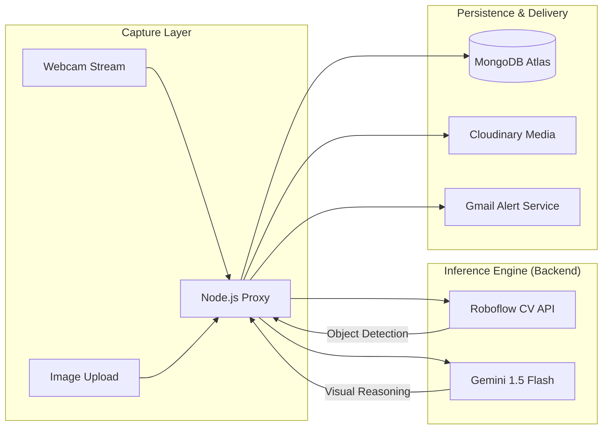

# <p align="center">🏗️ SafetySnap: Enterprise AI-Powered Safety Surveillance</p>

<p align="center">
  
  
  
  
</p>

---

## 🌟 Overview
**SafetySnap** is a next-generation safety monitoring solution that leverages **Computer Vision** and **Large Language Models (LLMs)** to ensure workplace safety. By combining **Roboflow's** precise detection models and **Google Gemini's** contextual reasoning, the platform provides real-time compliance tracking, bilingual safety suggestions, and comprehensive executive analytics.

---

## 📐 System Architecture

### 🔄 High-Level Data Flow


---

## 📂 Project Structure

```text
SafetySnap/
│
├── hardware/
│   └── esp32/
│       ├── safetysnap_firmware/
│       │   ├── safetysnap_firmware.ino   # Main firmware (HTTP v3)
│       │   └── config.h                  # All user-configurable settings
│       └── HARDWARE_GUIDE.md
│
├── backend/
│   ├── config/
│   │   └── db.js                   # MongoDB connection
│   ├── models/
│   │   ├── Image.js                # Readings & AI results schema
│   │   └── User.js                 # Auth user schema
│   ├── routes/
│   │   ├── auth.js                 # Register, login, forgot-pass
│   │   ├── images.js               # POST upload, AI processing
│   │   ├── analytics.js            # Summary & Trends
│   │   └── live.js                 # Frame detection routes
│   ├── services/
│   │   ├── roboflowService.js      # PPE Detection logic
│   │   ├── geminiService.js        # AI Safety Reasoning
│   │   └── emailService.js         # SMTP notification engine
│   ├── middleware/
│   │   └── auth.js                 # JWT verification middleware
│   ├── tests/                      # Unit & Integration tests
│   ├── utils/
│   │   └── hash.js                 # File deduplication (MD5)
│   └── server.js                   # Entry point: Express Server
│
├── frontend/
│   └── src/
│       ├── components/
│       │   ├── layout/             # Header, Sidebar
│       │   ├── dashboard/          # StatsCards, DigitalTwin
│       │   ├── charts/             # Analytics Charts
│       │   ├── ui/                 # Modals, Cards, Toasts
│       │   └── auth/               # ProtectedRoute
│       ├── pages/                  # Route-level pages (Home, Upload, etc.)
│       ├── context/                # Auth, Toast providers
│       └── utils/                  # API client, helper functions
│
├── docker-compose.yml
├── .env.example
└── README.md
```

---

## 🧠 AI Intelligence Layer

| Capability | Provider | Implementation |
| :--- | :--- | :--- |
| **PPE Detection** | **Roboflow** | Custom-trained YOLO model detecting `helmet`, `no_helmet`, `vest`, `no_vest`. |
| **Safety Reasoning** | **Google Gemini** | Analyzes the scene to provide human-like advice (e.g. "It's hot, stay hydrated"). |
| **Language Localization** | **Gemini Pro** | Automatic translation into high-natural Devanagari Hindi for on-site workers. |

---

## ⚙️ Setup Instructions

### 1. Backend Config (`/backend/.env`)
```env
MONGO_URI=your_mongodb_connection
JWT_SECRET=your_jwt_secret
ROBOFLOW_API_KEY=your_key
GEMINI_API_KEY=your_key
CLOUDINARY_CLOUD_NAME=your_name
CLOUDINARY_API_KEY=your_key
CLOUDINARY_API_SECRET=your_secret
EMAIL_USER=yourgmail@gmail.com
EMAIL_PASS=your_gmail_app_password
```

### 2. Run Locally
```bash
# Terminal 1
cd backend && npm install && npm run dev

# Terminal 2
cd frontend && npm install && npm run dev
```

---

## 📜 License
This project is licensed under the MIT License - see the [LICENSE](LICENSE) file for details.

---

<p align="center">
  Developed by <strong>Zeyaul Hasan</strong> | © 2026 SafetySnap AI
</p>